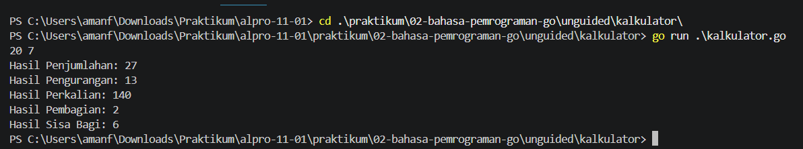
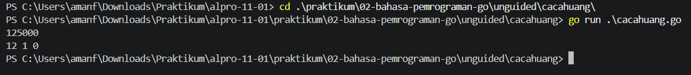

# <h1 align="center">Laporan Praktikum Modul [00] - [Bahasa Pemograman Go]</h1>
<p align="center">[Amanullah Risky Maya Sekti] - [109092600020]</p>

## Dasar Teori

### A. [Bahasa Pemrograman Go]
Go (Golang) adalah bahasa pemrograman open-source yang dikembangkan oleh Google pada tahun 2009. Menurut Donovan & Kernighan (2015), Go dirangcang untuk efisiensi, kesederhanaan, dan kemudahan dalam pengembangan perangkat lunak berskala besar. Go memiliki fitur seperti garbage collection, concurrency dengan goroutines, serta syntax yang sederhana namun kuat.

### B. [Package dan Struktur Program di Go]

#### 1. [Pengertian Package main dan func main()]
Dalam Go, Setiap program harus memiliki package utama yaitu ```package main```. fungsi ```fucn main ()``` adalah titik awal eksekusi program. Tanpa fungsi ini, program tidak akan berjalan. Package lain digunakan untuk mengorganisasi kode agar modular.

#### 2. [Tipe Data dan Deklarasi Variabel di Go]
Go memiliki tipe data dasar seperti ```int```. ```float64```, ```string```, dan ```bool```. Variable dapat dideklarasikan dengan kata kunci ```var``` , atau menggunakan shorthand := untuk deklarasi sekaligun inisialisasi. Contoh:
```go
var x int = 10
y := 20
```

<!-- Tambahkan poin A, B, C, ... atau sub-topik 1, 2, 3, ... sesuai kebutuhan modul -->

## Guided

### 1. [skor.go]

```go
package main
import "fmt"

func main() {
	var nama string
	var skorMatematika, skoringgris int

	//Membaca input dari user
	fmt.Scan (&nama)
	fmt.Scan (&skorMatematika)
	fmt.Scan (&skoringgris)

	//menghitung total skor & rata-rata skor
	totalSkor := skorMatematika + skoringgris
	rataRataSkor := totalSkor / 2

	//menampilkan output
	fmt.Println("Nama:", nama)
	fmt.Println("Total Skor:", totalSkor)
	fmt.Println("Rata-rata Skor:", rataRataSkor)
}
```
#### Deskripsi
Program ini membaca input nama dan dua skor (matematika dan inggris), lalu menghitung tital dan rata-rata skor. Outpun berupa nama, total skor, dan rata-rata skor.

### 2. [tukar.go]

```go
package main
import "fmt"

func main() {
	var nilai1, nilai2 int

	//Membaca input dari user
	fmt.Scan(&nilai1)
	fmt.Scan(&nilai2)

	//menukar nilai
	nilai1, nilai2 = nilai2, nilai1

	//Menampilkan hasil
	fmt.Println("Setelah ditukar:")
	fmt.Println("Nilai 1:", nilai1)
	fmt.Println("Nilai 2:", nilai2)
}
```
#### Deskripsi
Program ini membaca dua nilai integer, lalu menukar nilainya menggunakan assignment simultan

### 3. [lingkaran.go]

```go
package main
import "fmt"

func main() {
	var pi float64 = 3.14
	var jariJari float64

	fmt.Print("Masukkan jari-jari lingkaran: ")
	fmt.Scan(&jariJari)

	var luas float64 = pi * jariJari * jariJari
	var keliling float64 = 2 * pi * jariJari

	fmt.Printf("Luas lingkaran: %.2f\n", luas)
	fmt.Printf("Keliling lingkaran: %.2f\n", keliling)
}
```
#### Deskripsi
Program ini menghitung luas dan keliling lingkaran berdasarkan jari-jari yang di input

<!-- Tambahkan blok file/kode lain sesuai jumlah file pada soal guided -->

## Unguided

### 1. [kalkulator]

```go
package main
import ("fmt")

func main() {
	var a, b int
	fmt.Scan(&a, &b)

	tambah := a + b
	kurang := a - b
	kali := a * b
	bagi := a / b
	sisa := a % b

	fmt.Println("Hasil Penjumlahan:", tambah)
	fmt.Println("Hasil Pengurangan:", kurang)
	fmt.Println("Hasil Perkalian:", kali)
	fmt.Println("Hasil Pembagian:", bagi)
	fmt.Println("Hasil Sisa Bagi:", sisa)
}

```

##### Output
<!-- Path relatif dari readme.md ke folder unguided/[nama_soal]/output.png, contoh: -->



#### Deskripsi
program ini di khususkan untuk menerima dua bilangan bulat, lalu menghitung hasil penjumlahan, pengurangan, perkalian, pembagian, dan sisa bagi sekaligus.

### 2. [cacahuang]

```go
package main
import ("fmt")

func main() {
	var totalUang int

	//membaca masukan nominal uang
	fmt.Scan(&totalUang)

	//menghitung lembar puluhan ribu
	sepuluhribu := totalUang / 10000
	sisa := totalUang % 10000

	//menghitung lembar lima ribu
	limaribu := sisa / 5000
	sisa = sisa % 5000

	//menghitung lembar  seriburibu
	seribu := sisa / 1000
	
	//menampilkan hasil keluaran sesuai format
	fmt.Printf("%d %d %d\n", sepuluhribu, limaribu, seribu)
}
```

##### Output


#### Deskripsi
program ini di khususkan untuk menerima input berupa nominal uang, lalu menghitung jumlah lembar pecahan 10k, 5k, dan 1k

<!-- Duplikasi blok "### [nama_soal]" sesuai jumlah folder soal di dalam unguided -->


## Kesimpulan
Praktikum ini menunjukan dasar penggunaan bahasa Go. Pada bagian guided, saya masih mendapatkan arahan dari asisten dosen sehingga lebih mudah memahami konsep dasar bahasa Go, seperti struktur program, penggunaan ```package main```, fungsi ```func main()```, serta cara membaca input dan menampilkan output. Sedangkan pada bagian unguided, saya diharuskan untuk mengerjakan sepenuhnya sendiri tanpa bantuan, sehingga melatih kemampuan problem solving dan menerapkan logika secara mandiri. Dari kedua bagian ini, saya belajar bahwa guided membantu membangun fondasi, semetara unguided mengasah kemandirian dan kreativitas dalam menyelesaikan persoalan nyata menggunakan Go 

## Referensi
1. Donovan, A. A., & Kernighan, B. W. (2015). The Go Programming Language. New York: Addison-Wesley Professional.Diakses pada 25 september 2026 melalui https://openlibrary.telkomuniversity.ac.id/pustaka/196912/the-go-programming-language.html
2. Widianto, A. (2020). Pemrograman Go untuk Pemula. Jakarta: Elex Media Komputindo. Diakses pada 25 september 2026 melalui https://www.scribd.com/document/980192097/Pengantar-Bahasa-Pemrograman-Go
<!-- Tambahkan nomor referensi berikutnya sesuai kebutuhan -->
