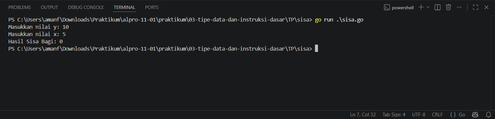
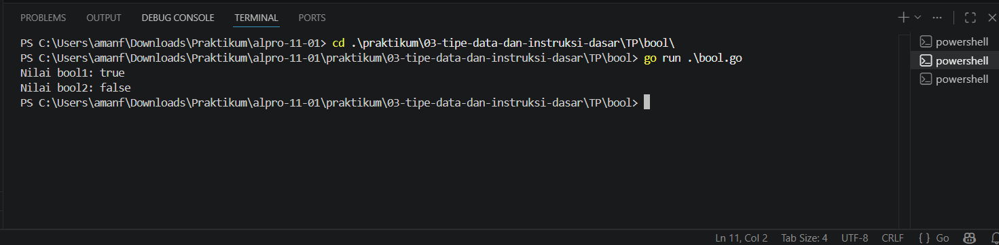
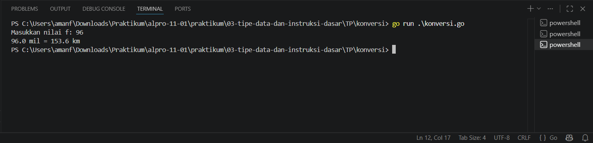

# <h1 align="center">Tugas Pendahuluan Modul 03 - “VARIABEL DAN OPERATOR” </h1>
<p align="center">Amanullah Risky Maya Sekti - 109092600020 </p>

### 1. Sisa Kue

```go
package main

import "fmt"

func main() {
	var y, x int
	fmt.Print("Masukkan nilai y: ")
	fmt.Scan(&y)
	fmt.Print("Masukkan nilai x: ")
	fmt.Scan(&x)

	sisa := y % x
	fmt.Println("Hasil Sisa Bagi:", sisa)
}
```

##### Output
<!-- Path relatif dari readme.md ke folder unguided/[nama_soal]/output.png, contoh: -->



#### Deskripsi
program ini di buat untuk membagikan kue agar dapat mengetahui sisanya, y sebagai variable kue dan x sebagai variable orang dan menggunakan operator %

### 2. [bool]

```go
package main 

import "fmt"

func main() {
	bool1 := true
	bool2 := false

	fmt.Println("Nilai bool1:", bool1)
	fmt.Println("Nilai bool2:", bool2)
}
```

##### Output
<!-- Path relatif dari readme.md ke folder unguided/[nama_soal]/output.png, contoh: -->



#### Deskripsi
program ini bertujuan untuk memberikan jawaban berupa TRUE/FALSE

### 3. [konversi]

```go
package main

import "fmt"

func main() {
	var f float64
	fmt.Print("Masukkan nilai f: ")
	fmt.Scan(&f)

	const mil = 1.6
	km := f * mil
	fmt.Printf("%.1f mil = %.1f km", f, km)
}

```

##### Output
<!-- Path relatif dari readme.md ke folder unguided/[nama_soal]/output.png, contoh: -->



#### Deskripsi
program ini bertujuan untuk mengubah suatu nilai mil menjadi nilai kilometer dengan coding float yang akan mengeluarkan hasil desimal


## Kesimpulan
tugas ini mengharuskan kita untuk mengingat dan menerapkan materi yang sudah di ajarkan dosen sebelum melakukan praktikum lanjutan